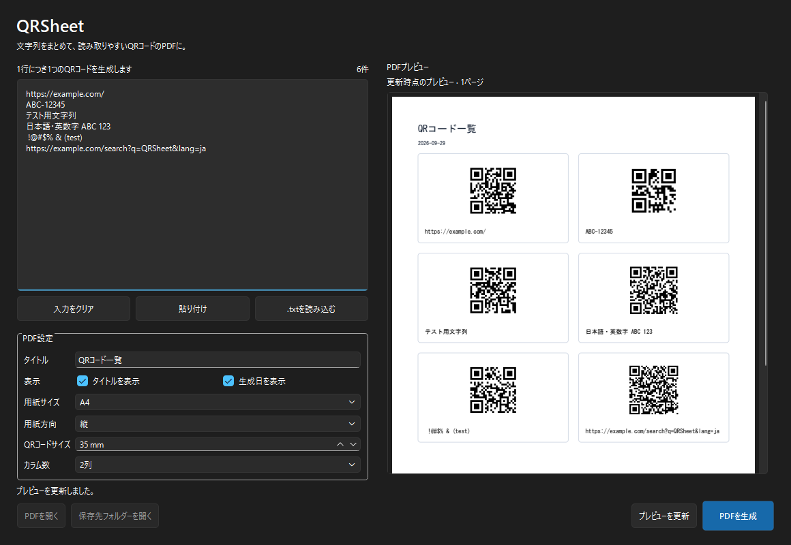

# QRSheet

複数行の文字列をQRコードに変換し、元の文字列と一緒に見やすいPDFにまとめるWindows向けデスクトップアプリです。日本語UIで操作でき、入力データを外部へ送信しません。

## 主な機能

- 1行につき1個のQRコード。空行・空白のみの行を無視し、有効行の前後の空白は保持
- 日本語・英数字・URL・記号のUTF-8 QRコード
- A4 / Letter、縦 / 横、QRサイズ20〜60mm、自動 / 1〜4列
- タイトル・生成日の表示切り替え、ページ番号
- 長文の折り返し・文字サイズ調整、セル単位での自動改ページ
- 実際に生成したPDFをアプリ内で複数ページプレビュー
- 貼り付け・Ctrl+V・入力クリア・UTF-8の`.txt`読み込み
- バックグラウンド生成、進捗表示、日本語エラー案内
- PDFと保存先フォルダーを開く操作
- 最後に使用した設定を保存（QR用入力データは保存しません）

## スクリーンショット



## 開発環境のセットアップ

Windows 10 / 11、Python 3.12以降の64bit版を使用します。以下はリポジトリ直下で実行するPowerShell用コマンドです。仮想環境の有効化は不要です。

```powershell
py -3.12 -m venv .venv
.\.venv\Scripts\python.exe -m pip install --upgrade pip
.\.venv\Scripts\python.exe -m pip install -e ".[dev]"
```

Pythonの別バージョンを使う場合は`-3.12`をそのバージョンに置き換えてください。動作確認環境はWindows 11 / Python 3.12.10です。

## 起動

```powershell
.\.venv\Scripts\python.exe -m qrsheet.main
```

## PDF生成

1. 入力欄へ文字列を1行ずつ入力するか、貼り付け・テキスト読み込みを使います。
2. 用紙・QRサイズ・カラム数・タイトル・日付を設定します。
3. 必要に応じて「プレビューを更新」で確認します。入力や設定を変更した場合は再更新してください。
4. 「PDFを生成」を押し、保存ダイアログで保存先を指定します。
5. 完了メッセージを確認し、「PDFを開く」で結果を開きます。

生成中の入力変更は実行中のPDFには反映されません。生成が完了してからアプリを終了してください。

## テスト

```powershell
.\.venv\Scripts\python.exe -m pytest -q
```

QRの実デコードによるUTF-8バイト列一致、1件 / 複数件 / 100件、空行、日本語、URL、長文、1〜4列、自動列数、複数ページ、用紙方向、エラー時の既存ファイル保護、設定復元、GUIプレビューを検証します。

サンプルPDF・レンダリング画像・GUIスクリーンショットの生成:

```powershell
.\.venv\Scripts\python.exe tests\verify_visuals.py
```

`output/pdf/`へ通常・長文・100件のPDFを生成します。検証用にGUIを短時間表示し、`assets/screenshot.png`を更新します。PDFを画像化して6件のQRをデコードし、入力との一致を検証します。

## Windows exeのビルド

セットアップ後、リポジトリ直下で実行します。

```powershell
.\build.bat
.\dist\QRSheet\QRSheet.exe
```

PyInstallerのonedir方式です。配布時は`dist/QRSheet/`フォルダー全体をZIP等にまとめてください。exeだけを取り出すと動作しません。利用者側にPythonのインストールは不要です。`build/`、`dist/`と自動生成の`*.spec`はGit対象外で、`build.bat`をビルド設定の原本としています。

ビルドスクリプトはそのプロセス内の`PATH`を仮想環境とWindows標準フォルダーに限定します。開発ツールが持つ別バージョンのICU / OpenSSL DLLの混入を防ぐためです。ユーザー環境の永続的な`PATH`は変更しません。

## 日本語フォント

Windowsのフォントフォルダーを環境変数`WINDIR`から解決し、MS Gothic → Meiryo → Yu Gothicの順で読み込み可能なTrueTypeフォントを探します。PDFには使用するグリフをサブセット埋め込みします。フォントファイルをリポジトリやexeに同梱しません。

フォントがない環境ではWindowsの日本語追加フォントを導入してください。別の埋め込み可能な日本語TrueTypeフォントを使う場合は`QRSHEET_FONT`にファイルパスを指定できます。フォントのライセンス・埋め込み許諾は使用するフォントに従ってください。

絵文字・外字など、選択したフォントが持たない文字は、欠けたPDFを生成せず日本語エラーで通知します。タブはPDF上では4個の空白相当で表示し、QRには元のタブを保持します。

## 構成・設計

```text
src/qrsheet/
  main.py                起動・ログ
  ui/main_window.py      日本語GUI・QThread・PDFプレビュー
  qr/generator.py        入力行処理・QR生成・元文字列と行列の保持
  pdf/generator.py       ベクターQR描画・PDF保存
  pdf/layout.py          用紙寸法・列数・文字幅計算
  pdf/fonts.py           日本語フォント検出
  settings/manager.py    設定データ・検証・QSettings
tests/                   QR・PDF・GUI・設定のテスト
```

QRと元文字列を同一のデータ構造で保持します。QRは4モジュールのQuiet Zone付きで、PDFには黒い矩形のベクターとして描画するため補間によるぼけがありません。行内の最大セル高を計算して改ページし、QRと全文ラベルを同じページに保ちます。保存は保存先と同じフォルダーの一時ファイルで生成後に置換し、途中の失敗で既存PDFを壊しません。

設定はQSettingsにより`HKEY_CURRENT_USER\Software\QRSheet\QRSheet`へ保存します。ログはQtの`AppLocalDataLocation`配下（通常`%LOCALAPPDATA%\QRSheet\QRSheet\qrsheet.log`）に最大1MB・2世代で保存します。プレビュー用PDFは一時フォルダーに作成し、通常終了時に削除します。異常終了時には一時ファイルが残ることがあります。

## 制限事項

- 1回の生成は最大10,000件、読み込むテキストファイルは10MBまでです。
- QRの容量はUTF-8のバイト数・文字種に依存します。容量を超える入力は項目番号付きエラーになります。
- QRの最小モジュール幅は0.30mmです。密度が高い場合はQRサイズを大きくしてください。用紙に収まらないサイズ・列数の組み合わせはエラーになります。
- 長文は全文を保持して折り返し、必要なら6ptまで縮小します。それでも1ページに収まらない場合は列数等の変更を案内します。
- 確認環境はWindows 11です。Windows 10実機、各種プリンター、各種高DPI倍率の網羅的な検証は未実施です。
- 生成中のキャンセル、CSV / Excel読み込み、インストーラー、実行ファイルの署名は未実装です。

## 使用ライブラリ・ライセンス

QRSheet本体はMIT Licenseです（`LICENSE`参照）。主要ライブラリはPySide6（GUI / Qt PDF）、qrcode（QR）、ReportLab（PDF）、PyInstaller（配布ビルド）。テストにはpytest、pypdf、Pillow、zxing-cppを使用します。依存ライブラリはそれぞれのライセンスに従います。特に配布時はQt / PySide6等のライセンス表示・再配布条件を確認してください。
